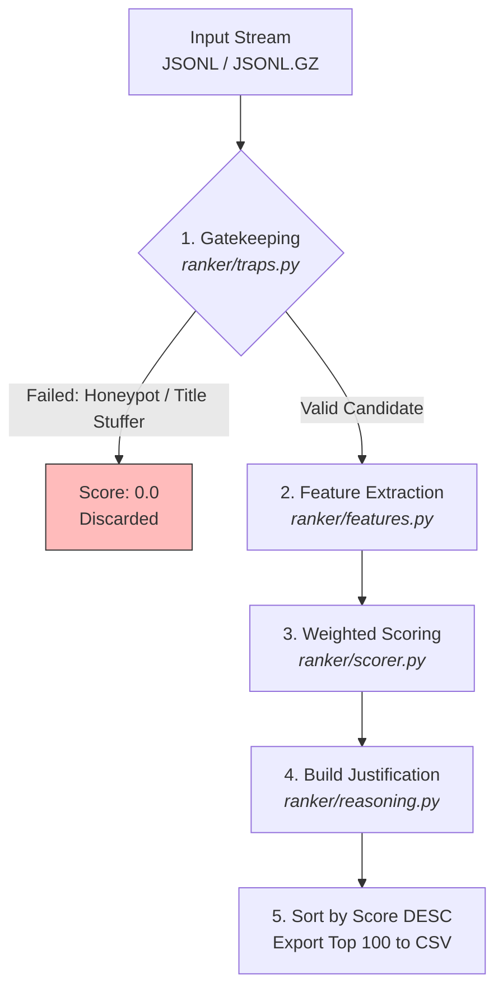

# Redrob Candidate Discovery Challenge: Heuristic Ranking Engine

A fast, optimized candidate ranking engine for the Redrob Intelligent Candidate Discovery Challenge. Processes, sanitizes, scores, and ranks candidate profiles with zero external dependencies.

Rejects LLM APIs and heavy frameworks (PyTorch, Pandas, Polars) to achieve **sub-second init** and **42x faster** execution than the challenge time limit.

## Performance Benchmarks

| Metric | Hackathon Constraint | Ours | Improvement |
| :--- | :--- | :--- | :--- |
| Execution Time (100k) | 300s (5 min) | **7.0s** | **97.6% faster (42x)** |
| Memory (RAM) | 16.0 GB | **< 1.8 GB** | **88.7% below limit** |
| Compute | Multi-Core / GPU | **Single CPU Core** | Zero GPU cost |
| Throughput | ~333/s | **~14,285/s** | High-throughput streaming |

## Architecture

Deliberate simplicity for speed, auditability, and zero runtime failures:

- **Zero dependencies** — Python 3 stdlib only (`gzip`, `json`, `csv`, `math`, `datetime`). No pip installs.
- **O(1) memory streaming** — generator pipeline processes `.jsonl`/`.jsonl.gz` line-by-line, never buffers.
- **Deterministic scoring** — rule-bound algorithm, fully reproducible, no LLM hallucination risk.

## Pipeline



## Code Structure

### Entrypoints
- **[rank.py](rank.py)** — Main orchestrator: streaming pipeline, filtering, scoring, sort, CSV export.
- **[validate_submission.py](validate_submission.py)** — Hackathon validation script for output structure/format.

### Scoring Core (`ranker/`)
- **[ranker/traps.py](ranker/traps.py)** — Gatekeeper: honeypot detection, title stuffing penalty, service-to-product filter, ghost candidate penalty.
- **[ranker/features.py](ranker/features.py)** — Extracts/normalizes: tech keywords, career longevity sweet-spot (6-8 yr peak), developer signals.
- **[ranker/scorer.py](ranker/scorer.py)** — Weighted synthesis (Technical 45%, Experience 25%, Shipper 20%, Behavioral 10%), location boost (1.2x), trap penalties.
- **[ranker/reasoning.py](ranker/reasoning.py)** — Deterministic fact-bound justifications from feature scores.
- **[ranker/constants.py](ranker/constants.py)** — Config, keyword lists, consulting firms, non-engineering titles.

## Score Matrix

```
Final Score = (Technical * 0.45 + Experience * 0.25 + Shipper * 0.20 + Behavioral * 0.10)
              * Location Boost (1.2x if match)
              * Trap Penalties
```

| Dimension | Weight | Components |
| :--- | :--- | :--- |
| **Technical** | 45% | Embedding/Retrieval (35%), Vector DBs (25%), Finetuning (25%), Eval Frameworks (15%) |
| **Experience** | 25% | AI Experience (40%), Total Exp Sweet-Spot 6-8yr (30%), Product Ratio (30%) |
| **Shipper** | 20% | Production Signal (50%), GitHub Signal (25%), Startup Bonus (25%) |
| **Behavioral** | 10% | Response Rate (35%), Activity Score (30%), Completion Rate (20%), Engagement (15%) |

## Usage

```bash
# Setup (stdlib only, env included for isolation)
conda env create -f environment.yml
conda activate redrob-ranker

# Rank candidates → top 100 CSV
python rank.py --candidates candidates.jsonl --out team_submission.csv

# Validate output
python validate_submission.py team_submission.csv
```

Supports both `.jsonl` and `.jsonl.gz` input.

## Contributors

- **Nalin Singh** - [@nalindotexe](https://github.com/nalindotexe)
